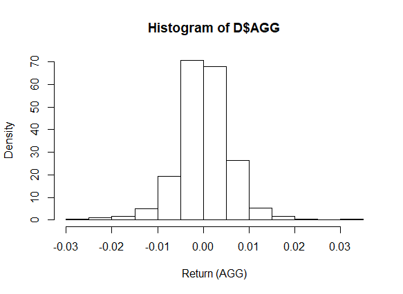

## Descriptive analysis

### a) A short description of the data

- Quantitative data
- Date of first observation: 2006-5-5, Date of the last observation: 2015-5-8
- The number of observations: 454

### b) A density histogram of the weekly return from the EFT AGG

<!--But why density? Is it not more clear with frequency?-->

