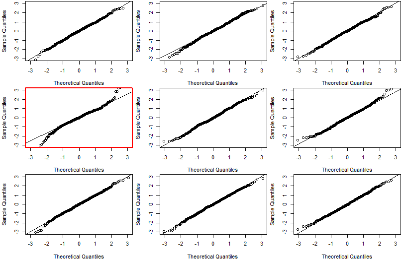
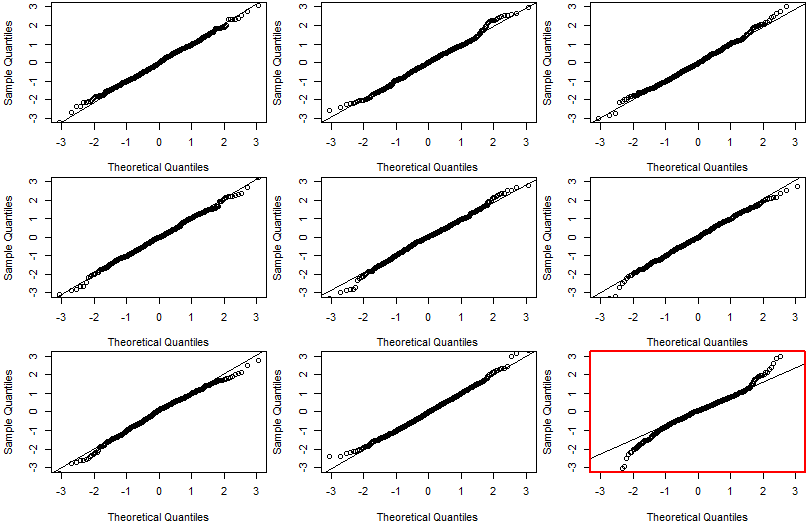
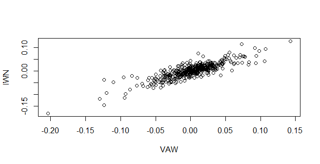

\pagenumbering{gobble} 
\definecolor{h}{HTML}{FFFF66}


\pagebreak
```{r setup, include=FALSE}
knitr::opts_chunk$set(echo = TRUE)
#source("bee_my_functions.R")
#library(dplyr)
setwd("/home/arm/Projects/statistics/r_scripts/ass1")
D <- read.table("finans1_data.csv", header=TRUE, sep=";", as.is=TRUE)
## Keep only the dates and the ETFs AGG, VAW, IWN, and SPY
D <- D[ ,c("t","AGG","VAW","IWN","SPY")]
```
\pagebreak
\pagenumbering{arabic} 

**!!!Det er er en genaflvering. Alle rettelser eller tilføjelser er markeret i kursiv. Alt R-outputtet blev også fjernet, som jeg fik en besked om.** 

## Descriptive analysis

### a) A short description of the data

- The weekly returns of ETF's are quantitative data.
- *Time is the type of Date.*
- Date of first observation: `2006-05-05`, Date of the last observation: `2015-05-08`
```{r include=FALSE}
D$t <- as.Date(D$t)
summary(D$t)
```
- The number of observations: 454
```{R include=FALSE}
nrow(D)
```
- There are no missing values.

```{R include=FALSE}
sum(is.na(D))
```


### b) A density histogram of the weekly return from AGG

<!--But why density? Is it not more clear with frequency?-->


- The empirical density is symmetrical, because both tails seems to have similar lengths. 
- The returns can be both positive and negative.
- There is not much variation. The observations are distributed around 0.00 and the most of observations lies between -0.02 and 0.02. 

<!-- Skal det begrundes mere? -->


\pagebreak

### c) Plots illustrating the weekly returns over time
<!--
\colorbox{h}{Kunne være fedt at tegne grafen hvis den under 0, så rød, hvis det er over 0 så grøn.}
-->
In general from the plots in Figures 2, 3, 4 and 5 in the following pages the level of returns seem to change over time. The most significant different period is around 2008-2010, *where the volatility is highest for all for ETF's. This could be related to the global financial crisis. In addition the volatility of all four ETF's is higher in the second half-year of 2011, which could be related to European sovereign debt crisis.* [^crisis]

[^crisis]: https://en.wikipedia.org/wiki/August_2011_stock_markets_fall
  
  Specifically AGG stands out from others by having the smallest volatility. *AGG also dropped least in the global financial crisis.*
  
  *On the other hand it seems that VAW has the highest volatility. Moreover, VAW had the biggest drop in the global finance crisis, where it felt at most more than 20% in a week.* 
  
  *SPY and IWN seems to be in between of these two above mentioned EFT's in relation to volatility. However SPY seems to have smaller volatility than IWN. In addition SPY didn't drop that much in the global finance crisis as IWN.*
  
  *Lastly from 2012 it seems that all four ETF's had more constant volatility and the weekly returns of all four ETF's were more positive than negative.*
 
<!--and 2011-2012 where level of return is increased.-->

\pagebreak

{width=85%}


{width=85%}

{width=85%}


{width=85%}


\pagebreak


### d) A box plot of the weekly returns 

- From the box plot below there seems to be a difference between the distributions in the way that VAW has the most left-skewed distribution, because the left tail is longer than the right tail. *IWN and SPY are similarly left-skewed, but less than VAW. Only AGG seems to be a bit right-skewed.*
- Moreover AGG has the narrowest IQR. *SPY has the second narrowest IQR, then goes IWN and lastly VAW has the widest IQR.*
- The extreme observations are outside a distance of $1.5*\text{IQR}$ from $Q_1$/$Q_3$. In the box plot below outliers are plotted individually, so yes there are plenty of these. *In addition it seems that VAW has the highest number of outliers, which are also the most dispersed. IWN has the second highest number of outliers. Then there is SPY and AGG has the least number of outliers.* 


 \pagebreak
 
<!--  and the mean lies to the left of the median. VAW. Mean is 0.001794 and median 0.004798. So that the mean lies to the left of the median. That means that is left-skewed distribution. -->


### e) Summary statistics

|                             | AGG         | VAW         | IWN         | SPY          |
| --------------------------- | ----------- | ----------- | ----------- | ------------ |
| **Number of obs.** ($n$)    | 454         | 454         | 454         | 454          |
| **Sample mean** ($\bar{x}$) | 0.000265757 | 0.00179379  | 0.001187679 | 0.001360105  |
| **Sample variance** ($s^2$) | 0.00003571  | 0.001301973 | 0.00102499  | 0.0006143463 |
| **Std. dev.** ($s$)         | 0.005975841 | 0.03608286  | 0.03201547  | 0.02478601   |
| **Lower quartile**($Q_1$)   | -0.0029733  | -0.016096   | -0.014305   | -0.011325    |
| **Median**($Q_2$)           | 0.0002374   | 0.004798    | 0.003120    | 0.004216     |
| **Upper quartile**($Q_3$)   | 0.0038932   | 0.019685    | 0.019056    | 0.014498     |

- *From the table we could clearly see that all ETF's have equally 454 observations.*
- In the table there are also the means and the medians of ETF's. These values underpin the findings in relation to the skewness in the section above. 
    - *AGG is right-skewed distribution, because AGG's mean of 0.000266 is higher than (right of)  AGG's median of 0.000237.*
    - *VAW is left-skewed  distribution, because VAW's mean of 0.00179 is less than(left of) VAW's median of 0.00479.*
    - *IWN is left-skewed  distribution, because IWN's mean of 0.00119 is less than IWN's median of 0.0031.*
    - *And lastly SPY is also left-skewed  distribution, because SPY's mean of 0.00136 is less then SPY's median of 0.00421. *
- *In addition one could gain information about volatility from sample variance or standard deviation parameters. So from the table we can conclude that VAW has the highest standard deviation. IWN has the second highest standard deviation. SPY has the third highest standard deviation, whilst AGG has the lowest standard deviation of the all four ETF's.* 
- *Lastly Lower and Upper quartiles shows the spread of the data. These values could also help to determine IQR, which could be used to find outliers.* 

\pagebreak

## Statistical analysis

### f) Statistical models

<!--Skal jeg arguementere hvovfor jeg har valgt normaldistribution? I bogen er der kun: "The normal distribution appears naturally for many phenomena... Side 71"-->


$$
\begin{aligned}
AGG \sim N(0.000265757,0.005975841^2 ) \\ 
VAW \sim N(0.00179379,0.03608286^2 ) \\
IWN \sim N(0.001187679,0.03201547^2 ) \\
SPY \sim N(0.001360105,0.02478601^2 ) \\
\end{aligned}
$$

#### Normality assumptions

- In order to perform normality validation there are produced Wally plots, which are in Figures 7, 8, 9 and 10 in the following pages.
- It seems from wally plots that the weekly returns of these four ETFs don't follow a normal distribution, because the data for all ETFs deviates more from the qqline than the simulated data in the wally plots. It is however more similar to the heavy-tailed distribution[^HEAVYTAILED]. 
- When we cannot assume a normal distribution comes CLT to rescue, because CLT states that "The underlying distribution of a sample can be disregarded when carrying out inference related to the the mean" [^DTU] (p. 136). This means that we can still define CIs and make Hypothesis tests for the mean based on the standard normal quantiles/t-quantiles, although the distribution of weekly returns doesn't follows a normal distribution, because the sample means of repeatedly taken large enough samples ($n>=30$) follows normal distribution.
- Moreover, "The t-test assumes that the means of the different samples are normally distributed; it does not assume that the population is normally distributed". [^TTEST] 

#### Independence assumptions

- *We know that the data were collected consistent at the beginning and at the end of every week over the given time period. So there is no sign for any independence violation. Therefore we can conclude that the assumption of independence holds for this dataset.*

\pagebreak 

{width=70%}


{width=70%}


{width=70%}


{width=70%}


<!--the initial pricen and the final price of every week.--> 

<!--It is because the data for all ETFs deviates more from the qqline(a straight line through the 1st and 3rd quantiles) than the simulated data in the wally plots. It seems though that these follows --> 
<!--Cauchy-->

[^TTEST]: [Stack exchange: T-test for non normal when N>50?](https://stats.stackexchange.com/questions/9573/t-test-for-non-normal-when-n50/9781#:~:text=Rules%20of%20thumb%20say%20that,have%20to%20be%20approximately%20normal.)
[^HEAVYTAILED]: [Stack exchange: How to interpres a gg plot]( https://stats.stackexchange.com/questions/101274/how-to-interpret-a-qq-plot) 

\pagebreak

### g) 95% confidence interval for the mean


|      | Lower bound of CI | Upper bound of CI |
| ---- | ----------------- | ----------------- |
| AGG  | -0.0002854073     | 0.0008169213      |
| VAW  | -0.001534208      | 0.005121788       |
| IWN  | -0.001765174      | 0.004140533       |
| SPY  | -0.000925960      | 0.003646171       |

##### First define t-quantile, which is going to be used in the formulas

- $t_{0.975}$ 0.975 t-quantile with n-1=434 degress of freedom equals to 1.965215:

```{r include=FALSE}
qt(0.975,454-1)
```


##### CI for AGG

$$
\begin{aligned}
\bar{x}\pm t_{0.975}* \frac{s}{\sqrt{n}} = 0.000265757 \pm 1.965215 * \frac{0.005975841}{\sqrt{454}} =\\
= 0.000265757 \pm 0.0005511643 = [-0.0002854073, 0.0008169213 ]
\end{aligned}
$$
<!--
The same results could be produced by `t.test`:

```{R echo=FALSE}
t.test(D$AGG, conf.level=0.95)$conf.int
```
-->

##### CI for VAW

$$
\begin{aligned}
\bar{x}\pm t_{0.975}* \frac{s}{\sqrt{n}} = 0.00179379 \pm 1.965215
* \frac{0.03608286}{\sqrt{454}} = \\=  0.00179379 \pm  0.003327998 = [-0.001534208,  0.005121788 ]
\end{aligned}
$$
<!--
The same results could be produced by `t.test`:

```{R echo=FALSE}
t.test(D$VAW, conf.level=0.95)$conf.int
```
-->

##### CI for IWN

$$
\begin{aligned}
\bar{x}\pm t_{0.975}* \frac{s}{\sqrt{n}} =0.001187679 \pm 1.965215* \frac{0.03201547}{\sqrt{454}} = \\= 0.001187679  \pm 0.002952853  = [-0.001765174,  0.004140533 ]
\end{aligned}
$$
<!--
The same results could be produced by `t.test`:

```{R echo=FALSE}
t.test(D$IWN, conf.level=0.95)$conf.int
```
-->

##### CI for SPY

$$
\begin{aligned}
\bar{x}\pm t_{0.975}* \frac{s}{\sqrt{n}} = 0.001360105 \pm 1.965215* \frac{0.02478601}{\sqrt{454}} = \\= 0.001360105  \pm 0.002286065  = [-0.000925960, 0.003646171]
\end{aligned}
$$
<!--
The same results could be produced by `t.test`: 

```{R echo=FALSE}
t.test(D$SPY, conf.level=0.95)$conf.int
```
-->

#### Note

 95% CI means that we can only be sure 95% that our calculated CI will contain the true mean. That is, if we could take 100 samples and calculate CI, only 95 of these would contain the true mean.

### h) Hypothesis test


$$
\begin{aligned}
H_0: \mu_{\text{AGG}} = 0 \\
H_1: \mu_{\text{AGG}} \ne 0
\end{aligned}
$$

- I choose $\alpha=0.05$ significant level (some evidence).


**By using Method 3.36**

**1. The test statistics: **  
$$
t_{obs}= \frac{\bar{x}-\mu_{0}}{s/\sqrt{n}}= \frac{0.000265757}{0.005975841/\sqrt{454}} = 0.2983265
$$

**2. p-value** 
$$
\text{p-value}= 2*P(T>|t_{obs}|) = 2*0.1719256 =0.3438511
$$
- With the degree of freedom $454-1= 453$

```{R include=FALSE}
#tobsAGG <- (meanAGG)/(sAGG/sqrt(454))
#2*(1-pt(tobsAGG, df=454-1))
```

**3.  Conclusion:**

$\text{p-value}$ (0.3438511) is more than $\alpha$ (0.05), so we *failed to reject* $H_{0}$.  That means that the mean weekly returns from AGG does not deviate significantly from the returns obtained by saving money under the pillow.

 The same conclusion could have been reached using the CI, because it includes 0, which means that 0 is accepted value at 95% significant level.
 <!--
**t.test** 

The same p-value could be produced by `t.test`:

```{R echo=FALSE}
t.test(D$AGG, mu=0)
```
-->

### i) Welch t-test for compering AGG and VEW 


$$
\begin{aligned}
H_{0} \ : \ \mu_{AGG}= \mu_{VAW}  \\
H_{1}\ : \ \mu_{AGG} \ne \mu_{VAW} 
\end{aligned}
$$

- I choose $\alpha=0.05$ significant level (some evidence).


**By method 3.51(Welch):**


**1. The test statistics** 

$$
\begin{aligned}
t_{obs}= \frac{(\bar{x}_1-\bar{x}_2)-\delta_0}{\sqrt{s_1^2/n_1+s^2_2/n_2}}= -1.973387
\end{aligned}
$$


```{R include=FALSE}
#tobsAGGVAW <- (meanAGG-meanVAW)/(sqrt((sAGG^2/454)+(sVAW^2/454)))
# vAGGVAW <- ((sAGG^2/454)+(sVAW^2/454))^2/(((sAGG^2/454)^2/(454-1))+((sVAW^2/454)^2/(454-1)))
```


**2. p-value** 

$$
\text{p-value} = 2*P(T>|t_{obs}|) = 2 * 0.1869052= 0.3738104
$$


With the degree of freedom:

$$
\begin{aligned}
v = \frac{(\frac{s^2_1}{n_1}+\frac{s^2_2}{n_2})^2}{\frac{(s_1^2/n_1)^2}{n_1-1}+\frac{(s_2^2/n_2)^2}{n_2-1}}= 54.38591
\end{aligned}
$$

```{R include=FALSE}
# 2*(1-pt(abs(tobsAGGVAW), df=vAGGVAW))
```

**3. Conclusion**

On a 5% level we cannot conclude a significant difference in the mean weekly return differs, because the calculated $\text{p-value}=0.3738104 > \alpha=0.05$  

<!--
**t.test** 

The same p-value could be produced by `t.test`:

```{R echo=FALSE}
t.test(D$VAW, D$AGG)
```
-->

### j) Conclusion from CIs

According to Remark 3.59, if CIs do overlap (like in this case), then the same conclusion couldn't be drawn from CIs. So it was necessary to carry out the statistical test.   

\pagebreak

### k) Correlation

<!--JEg er lidt forvirrede her omkring, hvilke notation skal jeg bruge her? Side 275 eller  Definition 1.18-->

*Correlation in general quantifies the strength of the relationship between two variables, but it doesn't  mean that one variable cause the other or vice versa. In financial market it can be used in the portfolio risk management.[^investopedia]*

[^investopedia]: https://www.investopedia.com/terms/c/correlation.asp


- Covariance between VAW and IWN is calculated by : 

$$
s_{VAWIWN} = \frac{1}{n-1}\sum_{i=1}^{n}{(VAW_{i}-\bar{VAW})(IWN_{i}-\bar{IWN})} = 0.0009838237
$$

- Correlation between VAW and IWN is calculated by:

$$
r = \frac{s_{VAWIWN}}{s_{VAW}*s_{IWN}} = 0.8516407
$$

The correlation of $0.85$ shows moderately strong linear relationship, which has a positive general trend. *This means as IWN increases, VAW does so as well and vice versa.* 

<!-- https://english.stackexchange.com/questions/30285/what-is-the-term-used-for-saying-if-something-increases-decreases-it-has-no-effe -->

*The same conclusion could be drawn from the scatter plot in Figure 10 below, because the most of observations are in the first and third quadrant, which forms a line going uphill.*



```{R include=FALSE} 
# plot(D$VAW, D$IWN, xlab="VAW", ylab="IWN")
```

<!--The calculated correlation is the same as in the table produced with `cor` below.-->

```{R include=FALSE}
cor(D[ ,c("AGG","VAW","IWN","SPY")], use="pairwise.complete.obs")
```


[^DTU]: Per B. Brockhoff, Jan K. Møller, Elisabeth W. Andersen Peder Bacher, Lasse E. Christiansen. "Introduction to Statistics at DTU". 2018 Fall
