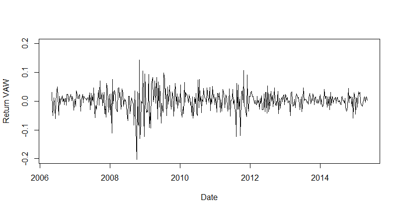

## Descriptive analysis

### a) A short description of the data

- Quantitative data
- Date of first observation: 2006-5-5, Date of the last observation: 2015-5-8
- The number of observations: 454
- There is no missing values. R code used to check this:

```R
> sum(is.na(D))
[1] 0
```


### b) A density histogram of the weekly return from the EFT AGG

<!--But why density? Is it not more clear with frequency?-->


- The empirical density is symmetrical, because there are no significant outliers. 
- The returns can be both positive and negative.
- There is not much variation. The observations are distributed around 0.00 and the most of observations lies between -0.02 and 0.02. 

<!-- Skal det begrundes mere? -->


### c) Plots illustrating the weekly return over time





- The level of return seem to change over time. The most significant different periods are around 2008-2010 and 2011-2012 where level of return is increased. 
-  AGG stands out from others by having a smaller variance. 


### d) A box plot of the weekly returns by ETF


- There seems to be a difference between the distributions in the way that VAW is more skewed than others.  VAW has left-skewed distribution, because the left tail is longer than the right tail. Others EFTs seems to have less skewed distributions.
- Moreover AGG has much narrower IQR  than other ETFs
- The extreme observations (outside a distance of $1.5*\text{IQR}$) here are plotted individually, so yes there are plenty of these. 

<!--  and the mean lies to the left of the median. VAW. Mean is 0.001794 and median 0.004798. So that the mean lies to the left of the median. That means that is left-skewed distribution. -->


### e) Summary statistics

|                             | AGG         | VAW         | IWN         | SPY          |
| --------------------------- | ----------- | ----------- | ----------- | ------------ |
| **Number of obs.** ($n$)    | 454         | 454         | 454         | 454          |
| **Sample mean** ($\bar{x}$) | 0.000265757 | 0.00179379  | 0.001187679 | 0.001360105  |
| **Sample variance** ($s^2$) | 0.00003571  | 0.001301973 | 0.00102499  | 0.0006143463 |
| **Std. dev.** ($s$)         | 0.005975841 | 0.03608286  | 0.03201547  | 0.02478601   |
| **Lower quartile**($Q_1$)   | -0.0029733  | -0.016096   | -0.014305   | -0.011325    |
| **Median**($Q_2$)           | 0.0002374   | 0.004798    | 0.003120    | 0.004216     |
| **Upper quartile**($Q_3$)   | 0.0038932   | 0.019685    | 0.019056    | 0.014498     |

- One could gain information about differences between the means and  the medians, so it is easier to determine if data is skewed. 

### f) Statistical models

- AGG seems to be not Normal. What to do? 
- I am not sure how I should relate CLT to this project. As I understand it should be taken  many samples. But here was taken only one sample, or not? 
- Jeg forstå heller ikke her hvad er population? Dvs. er det fremtiden? CTL siger, hvis vi tager 100 gange sample, så 95% skal indeholde den ægte mean. Men hvordan kan man tage en sample igen i dette tilfælde? 
- Eller at vi kan tage flere gange sample mean og deres mean vil være normally distributed. 
- Men CLT kan vi kun væer
- CLT means that we can be sure only 95% that our calculated Confidence interval will contain the true mean. That is, if we could take 100 samples, only 95 CI of these samples would contain the true mean.  
- When we cannot assume a normal distribution comes CLT to rescue. **OK we trying to find CI for the mean. And if the mean follows normal distribution so that's why we can find CI by using standard normal distribution or now t-distribution, although the distribution of population does not follow normal distribution**

### g) Confidence interval for the mean

```R
> qt(0.975,454-1)
[1] 1.965215
```


- AGG

$$
\bar{x}\pm t_{0.975}* \frac{s}{\sqrt{n}} = 0.000265757\pm * = \\= \pm  = [, ]
$$
