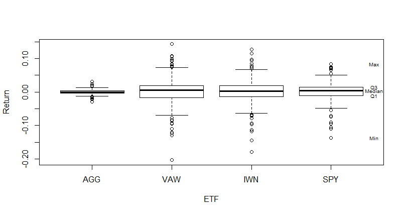

\pagenumbering{gobble} 

<!-- TODO
* Set figure captions (Nice to have)
--> 

\pagebreak
```{r setup, include=FALSE}
knitr::opts_chunk$set(echo = TRUE)
#source("bee_my_functions.R")
#library(dplyr)
setwd("/home/arm/Projects/statistics/r_scripts/ass1")
D <- read.table("finans1_data.csv", header=TRUE, sep=";", as.is=TRUE)
## Keep only the dates and the ETFs AGG, VAW, IWN, and SPY
D <- D[ ,c("t","AGG","VAW","IWN","SPY")]
```
\pagebreak
\pagenumbering{arabic} 

## Descriptive analysis

### a) A short description of the data

- Quantitative data
- Date of first observation: `2006-05-05`, Date of the last observation: `2015-05-08`
```{r}
D$t <- as.Date(D$t)
summary(D$t)
```
- The number of observations: 454
```{R}
nrow(D)
```
- There are no missing values:

```{R}
sum(is.na(D))
```


### b) A density histogram of the weekly return from the EFT AGG

<!--But why density? Is it not more clear with frequency?-->


- The empirical density is symmetrical, because both tails seems to have similar lengths. 
- The returns can be both positive and negative.
- There is not much variation. The observations are distributed around 0.00 and the most of observations lies between -0.02 and 0.02. 

<!-- Skal det begrundes mere? -->


### c) Plots illustrating the weekly return over time


- The level of return seem to change over time. The most significant different periods are around 2008-2010 and 2011-2012 where level of return is increased. 
-  AGG stands out from others by having a smaller variance. 


### d) A box plot of the weekly returns by ETF



- There seems to be a difference between the distributions in the way that VAW is more skewed than others.  VAW has left-skewed distribution, because the left tail is longer than the right tail. Others EFTs seems to have less skewed distributions.
- Moreover AGG has much narrower IQR  than other ETFs
- The extreme observations (outside a distance of $1.5*\text{IQR}$) here are plotted individually, so yes there are plenty of these. 

<!--  and the mean lies to the left of the median. VAW. Mean is 0.001794 and median 0.004798. So that the mean lies to the left of the median. That means that is left-skewed distribution. -->


### e) Summary statistics

|                             | AGG         | VAW         | IWN         | SPY          |
| --------------------------- | ----------- | ----------- | ----------- | ------------ |
| **Number of obs.** ($n$)    | 454         | 454         | 454         | 454          |
| **Sample mean** ($\bar{x}$) | 0.000265757 | 0.00179379  | 0.001187679 | 0.001360105  |
| **Sample variance** ($s^2$) | 0.00003571  | 0.001301973 | 0.00102499  | 0.0006143463 |
| **Std. dev.** ($s$)         | 0.005975841 | 0.03608286  | 0.03201547  | 0.02478601   |
| **Lower quartile**($Q_1$)   | -0.0029733  | -0.016096   | -0.014305   | -0.011325    |
| **Median**($Q_2$)           | 0.0002374   | 0.004798    | 0.003120    | 0.004216     |
| **Upper quartile**($Q_3$)   | 0.0038932   | 0.019685    | 0.019056    | 0.014498     |

- One could gain information about differences between the means and  the medians, so it is easier to determine if data is skewed. 

## Statistical analysis

### f) Statistical models

<!--Skal jeg arguementere hvovfor jeg har valgt normaldistribution? I bogen er der kun: "The normal distribution appears naturally for many phenomena... Side 71"-->


$$
\begin{aligned}
AGG \sim N(0.000265757,0.005975841^2 ) \\ 
VAW \sim N(0.00179379,0.03608286^2 ) \\
IWN \sim N(0.001187679,0.03201547^2 ) \\
SPY \sim N(0.001360105,0.02478601^2 ) \\
\end{aligned}
$$

- In order to perform normality validation there are used Wally plots. 
- The wally plot of AGG:


- The wally plot of VAW:


- The wally plot of IWN:


- The wally plot of SPY:


- It seems from wally plots that the weekly returns of these four ETFs don't follow a normal distribution, but it is more similar to the heavy-tailed distribution[^HEAVYTAILED]. 
- When we cannot assume a normal distribution comes CLT to rescue, because CLT states that "The underlying distribution of a sample can be disregarded when carrying out inference related to the the mean" [^DTU] (p. 136). This means that we can still define CIs and make Hypothesis tests for the mean based on the standard normal quantiles/t-quantiles, although the distribution of weekly returns doesn't follows a normal distribution, because the sample means of repeatedly taken large enough samples ($n>=30$) follows normal distribution.
- Moreover, "The t-test assumes that the means of the different samples are normally distributed; it does not assume that the population is normally distributed". [^TTEST]

<!--It is because the data for all ETFs deviates more from the qqline(a straight line through the 1st and 3rd quantiles) than the simulated data in the wally plots. It seems though that these follows --> 
<!--Cauchy-->

[^TTEST]: [Stack exchange: T-test for non normal when N>50?](https://stats.stackexchange.com/questions/9573/t-test-for-non-normal-when-n50/9781#:~:text=Rules%20of%20thumb%20say%20that,have%20to%20be%20approximately%20normal.)
[^HEAVYTAILED]: [Stack exchange: How to interpres a gg plot]( https://stats.stackexchange.com/questions/101274/how-to-interpret-a-qq-plot) 

\pagebreak

### g) 95% confidence interval for the mean


|      | Lower bound of CI | Upper bound of CI |
| ---- | ----------------- | ----------------- |
| AGG  | -0.0002854073     | 0.0008169213      |
| VAW  | -0.001534208      | 0.005121788       |
| IWN  | -0.001765174      | 0.004140533       |
| SPY  | -0.000925960      | 0.003646171       |

#### The formulas 
##### First define t-quantile, which is going to be used in the formulas
- $t_{0.975}$ 0.975 t-quantile with n-1=434 degress of freedom equals to 1.965215:

```{r}
qt(0.975,454-1)
```


##### CI for AGG

$$
\begin{aligned}
\bar{x}\pm t_{0.975}* \frac{s}{\sqrt{n}} = 0.000265757 \pm 1.965215 * \frac{0.005975841}{\sqrt{454}} =\\
= 0.000265757 \pm 0.0005511643 = [-0.0002854073, 0.0008169213 ]
\end{aligned}
$$

```{R}
t.test(D$AGG, conf.level=0.95)$conf.int
```

##### CI for VAW

$$
\begin{aligned}
\bar{x}\pm t_{0.975}* \frac{s}{\sqrt{n}} = 0.00179379 \pm 1.965215
* \frac{0.03608286}{\sqrt{454}} = \\=  0.00179379 \pm  0.003327998 = [-0.001534208,  0.005121788 ]
\end{aligned}
$$

```{R}
t.test(D$VAW, conf.level=0.95)$conf.int
```

##### CI for IWN

$$
\begin{aligned}
\bar{x}\pm t_{0.975}* \frac{s}{\sqrt{n}} =0.001187679 \pm 1.965215* \frac{0.03201547}{\sqrt{454}} = \\= 0.001187679  \pm 0.002952853  = [-0.001765174,  0.004140533 ]
\end{aligned}
$$

```{R}
t.test(D$IWN, conf.level=0.95)$conf.int
```

##### CI for SPY

$$
\begin{aligned}
\bar{x}\pm t_{0.975}* \frac{s}{\sqrt{n}} = 0.001360105 \pm 1.965215* \frac{0.02478601}{\sqrt{454}} = \\= 0.001360105  \pm 0.002286065  = [-0.000925960, 0.003646171]
\end{aligned}
$$

```{R}
t.test(D$SPY, conf.level=0.95)$conf.int
```

#### Note
 95% CI means that we can only be sure 95% that our calculated CI will contain the true mean. That is, if we could take 100 samples and calculate CI, only 95 of these would contain the true mean.

### h) Hypothesis test


$$
\begin{aligned}
H_0: \mu_{\text{AGG}} = 0 \\
H_1: \mu_{\text{AGG}} \ne 0
\end{aligned}
$$

- I choose $\alpha=0.05$ significant level (some evidence).


**By using Method 3.36**

**1.**  
$$
t_{obs}= \frac{\bar{x}-\mu_{0}}{s/\sqrt{n}}= \frac{0.000265757}{0.005975841/\sqrt{454}} = 0.2983265
$$

**2.** 
$$
\text{p-value}= 2*P(T>|t_{obs}|) = 0.3438511
$$

```r
> tobsAGG <- (meanAGG)/(sAGG/sqrt(454))
> 2*(1-pt(tobsAGG, df=454-1))
[1] 0.3438511
```

**3.  Conclusion:**

$\text{p-value}$ (0.3438511) is more than $\alpha$ (0.05), so we can accept $H_{0}$.  So the mean weekly returns from AGG does not deviate significantly from the returns obtained by saving money under the pillow.

 The same conclusion could have been reached using the CI, because it includes 0, which means that 0 is accepted value at 95% significant level. 


### i) Welch t-test for compering AGG and VEW 


$$
\begin{aligned}
H_{0} \ : \ \mu_{AGG}= \mu_{VAW} \equiv \mu_{AGG}-\mu_{VAW}= 0 \\
H_{1}\ : \ \mu_{AGG} \ne \mu_{VAW} \equiv \mu_{AGG}-\mu_{VAW}\ne 0
\end{aligned}
$$

- I choose $\alpha=0.05$ significant level (some evidence).


**By method 3.51(Welch):**


1. 

$$
\begin{aligned}
t_{obs}= \frac{(\bar{x}_1-\bar{x}_2)-\delta_0}{\sqrt{s_1^2/n_1+s^2_2/n_2}}= -1.973387\\
v = \frac{(\frac{s^2_1}{n_1}+\frac{s^2_2}{n_2})^2}{\frac{(s_1^2/n_1)^2}{n_1-1}+\frac{(s_2^2/n_2)^2}{n_2-1}}= 54.38591
\end{aligned}
$$


```r
> tobsAGGVAW <- (meanAGG-meanVAW)/(sqrt((sAGG^2/454)+(sVAW^2/454)))
[1] -0.8901926
> vAGGVAW <- ((sAGG^2/454)+(sVAW^2/454))^2/
+   (((sAGG^2/454)^2/(454-1))+((sVAW^2/454)^2/(454-1)))
[1] 477.8312


```


2. 

$$
\text{p-value} = 0.3738104
$$

```R
> 2*(1-pt(abs(tobsAGGVAW), df=vAGGVAW))
[1] 0.3738104
```

3. Conclusion

On a 5% level we cannot conclude a significant difference in the mean weekly return differs, because the calculated $\text{p-value}=0.3738104 > \alpha=0.05$  


```R
> t.test(D$VAW, D$AGG)

	Welch Two Sample t-test

data:  D$VAW and D$AGG
t = 0.89019, df = 477.83, p-value = 0.3738
alternative hypothesis: true difference in means is not equal to 0
95 percent confidence interval:
 -0.001844827  0.004900893
sample estimates:
  mean of x   mean of y 
0.001793790 0.000265757 
```


### j) Conclusion from CIs

According to Remark 3.59, if CIs do overlap (like in this case), then the same conclusion couldn't be drawn from CIs. So it was necessary to carry out the statistical test.   


### k) Correlation

<!--JEg er lidt forvirrede her omkring, hvilke notation skal jeg bruge her? Side 275 eller  Definition 1.18-->


$$
s_{VAWIWN} = \frac{1}{n-1}\sum_{i=1}^{n}{(VAW_{i}-\bar{VAW})(IWN_{i}-\bar{IWN})} = 0.0009838237
$$


```R
> covVAW_IWN <- sum((D$VAW-meanVAW)*(D$IWN-meanIWN))/453
[1] 0.0009838237
```


$$
r = \frac{s_{VAWIWN}}{s_{VAW}*s_{IWN}} = 0.8516407
$$

```r
> corrVAW_IWN <-covVAW_IWN / (sqrt(varVAW)*sqrt(varIWN))
[1] 0.8516407
```

- The calculated correlation is the same as in the table below.

```R
> cor(D[ ,c("AGG","VAW","IWN","SPY")], use="pairwise.complete.obs")
           AGG        VAW        IWN        SPY
AGG  1.0000000 -0.1975679 -0.1352621 -0.2187164
VAW -0.1975679  1.0000000  0.8516407  0.8863608
IWN -0.1352621  0.8516407  1.0000000  0.9100966
SPY -0.2187164  0.8863608  0.9100966  1.0000000
```

- The scatter plot below illustrates as expected moderately strong linear relationship, which has a positive general trend.


```R
plot(D$VAW, D$IWN, xlab="VAW", ylab="IWN")
```


[^DTU]: Per B. Brockhoff, Jan K. Møller, Elisabeth W. Andersen Peder Bacher, Lasse E. Christiansen. "Introduction to Statistics at DTU". 2018 Fall
